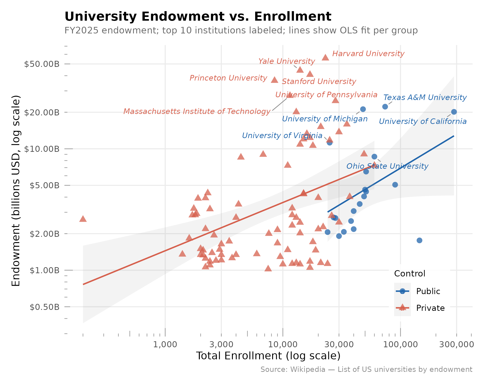

# University Endowment Analysis

**Research question:** What institutional characteristics predict university endowment size in the United States?

## Reproducing the analysis

Run scripts in order from the project root:

```bash
Rscript src/scrape_endowments.R
Rscript src/clean_endowments.R
Rscript src/model_endowments.R
Rscript src/plot_endowment.R
```

Required R packages: `tidyverse`, `rvest`, `glmnet`, `broom`, `ggrepel`, `scales`

---

## Data

### Sources

| File | Description |
|------|-------------|
| `data/raw/endowments_raw.csv` | Scraped from Wikipedia's [List of US universities by endowment](https://en.wikipedia.org/wiki/List_of_colleges_and_universities_in_the_United_States_by_endowment). Two tables on the page (private, public) are combined and labeled. 159 rows: 90 private, 69 public. Columns: Rank, Institution, State, FY2025 endowment ($B), FY2024 endowment ($B), YoY change (%). |
| `data/endowments_fallback.csv` | Hand-curated fallback (~125 universities) with enrollment, founding year, and control type. Used if scraping fails, and as the source of enrollment/founding year for the join. |
| `data/endowments_clean.csv` | Final analysis dataset (159 rows). Enrollment and founding year matched from the fallback for 104 institutions; these 104 form the modeling sample. |

### Cleaning

Wikipedia uses legal institution names (e.g., "The Trustees of Princeton University"). `src/clean_endowments.R` applies a manual lookup table for ~20 known mismatches and regex rules for common patterns before joining to the fallback on a normalized key (lowercase, punctuation stripped). Region is assigned from state using US Census four-region definitions. Log-transformed variables and institution age (2025 − founding year) are constructed at this stage.

---

## Methods

Two models predict log-endowment from the same set of predictors:

- **Outcome**: natural log of FY2025 endowment (billions USD)
- **Predictors**: log enrollment, institution age (years), control type (Public / Private), and US Census region
- **Sample**: n = 104 institutions with complete data
- **Reference categories**: Public (control), Midwest (region)

**OLS** is fit with `lm()`. **LASSO** is fit with `glmnet` (α = 1), penalty λ selected by 5-fold cross-validation at `lambda.min`. Both models are evaluated on identical 5-fold CV splits (seed 42) so RMSE numbers are directly comparable.

---

## Results

### Model fit

| Model | 5-Fold CV RMSE | λ |
|-------|---------------|---|
| OLS | 0.907 | — |
| LASSO | 0.899 | 0.053 |

LASSO edges out OLS by 0.9% on CV-RMSE — a negligible margin. The selected λ is small, meaning LASSO applies only light shrinkage and arrives at near-OLS predictions. With n = 104 and only 6 predictors, the dataset is too small and low-dimensional for regularization to provide meaningful gains, consistent with prior expectations.

OLS R² = 0.297; Adjusted R² = 0.253.

### OLS coefficients

| Term | Estimate | SE | t | p | |
|------|----------|----|---|---|-|
| (Intercept) | −3.910 | 0.995 | −3.93 | 0.0002 | *** |
| log(enrollment) | 0.387 | 0.087 | 4.45 | <0.001 | *** |
| Institution age (years) | 0.007 | 0.002 | 3.84 | 0.0002 | *** |
| Private (vs. Public) | 0.349 | 0.283 | 1.23 | 0.222 | |
| Region: Northeast | −0.074 | 0.261 | −0.28 | 0.778 | |
| Region: South | −0.066 | 0.256 | −0.26 | 0.796 | |
| Region: West | 0.137 | 0.328 | 0.42 | 0.677 | |

*Significance: \*\*\* p < 0.001*

**Log enrollment** and **institution age** are the only statistically significant predictors. A 10% increase in enrollment is associated with a ~3.9% larger endowment; each additional decade of institutional age adds ~7% to endowment on the log scale. The private/public gap (0.349 log points, ≈ 42% larger endowment) is not significant after conditioning on size and age, suggesting the raw public/private difference is largely explained by private schools being older and smaller. Region carries no predictive power.

### LASSO coefficients (λ = 0.053)

| Term | Estimate | Shrunk to zero? |
|------|----------|----------------|
| log(enrollment) | 0.287 | No |
| Institution age | 0.006 | No |
| Private (vs. Public) | 0.005 | No |
| Region: Northeast | 0.000 | Yes |
| Region: South | 0.000 | Yes |
| Region: West | 0.000 | Yes |

LASSO zeroes out all three region dummies, confirming they are noise given the other predictors. The private/public coefficient collapses to near zero (0.005), reinforcing the OLS finding that control type is nearly redundant once enrollment and age are controlled for.

### Figure



Log-log scatter of FY2025 endowment against enrollment, colored and shaped by control type. OLS trend lines are fit separately per group. Private institutions (triangles) sit consistently above the public trend line at every enrollment level, though the gap narrows at large enrollments. The top 10 institutions by rank are labeled.
